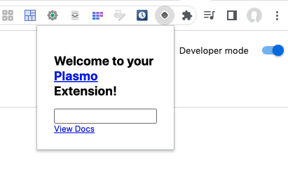

# browser-extension-plasmo-tutorial

Step by step tutorial(s) for Plasmo web browsers extension framework

Following the first video [Create a Google Chrome extension with ReactJS | Plasmo quickstart tutorial](https://www.youtube.com/watch?v=Fa2nFDw-dBw) (June 19th 2022 18mn)

```
$ node --version
v21.7.1
$ pnpm dlx plasmo init "browser-ext-plasmo-tutorial"
```


To run/compile/generate the extension:

```
$ cd browser-ext-plasmo-tutorial && pnpm dev
```


Now, go to the Chrome Extensions page:


Verify that the Developer mode is activated in the upper right corner and use the upper left button `Load unpacked` to select the newly generated extension code:


Once done, access the extension Icon in the upper right corner to pin the new extension:


The new extension icon is now visible within the list of pinned extensions in the upper right corner:


and once clicked the extension code is executed and appears:



Here the default generated code creates a popup and its code resides in the `popup.tsx` file but you can also use other browser API(s) to create new tabs, options UI, ...

Changing the text of the message in the code and having the dev server running in the background should automatically take new changes into account without having to do anything. If this is not the case, the reload button in the extention basic info pane can be used.


Another nice extension is [VRNBLTY](https://chromewebstore.google.com/detail/vrnblty/bmdonmceopndhkoaekmghcmfkipkehla?hl=fr) whose source can be found at [https://github.com/pacholoamit/VRNBLTY](https://github.com/pacholoamit/VRNBLTY)
which also calls some external API [https://haveibeenpwned.com/](https://haveibeenpwned.com/) to see if the domain of the current tab URL has been compromised.

One customization that this extension brings is that all the source code (including the popup.tsx file) resides within the `src` directory. This is done within the `tsconfig.json` file where

```
  "compilerOptions": {
    "paths": {
      "~*": [
        "./*"
      ]
    },
```

has been replaced by

```
  "compilerOptions": {
    "paths": {
      "~*": [
        "./src/*"
      ]
    },

```

Also the UI library used in this extension is [Mantine](https://ui.mantine.dev/)

```
$ pnpm install @mantine/core
```

but you could as well use [Material UI](https://mui.com/) or [Ant Design](https://ant.design/) however the philosophy for graphical parts of an extension is exactly the same than for any React project.

By default, Plasmo uses a small icon to identify the extension in `assets/icon.png` 

```
PNG image data, 512 x 512, 8-bit/color RGBA, non-interlaced
```

Plasmo automatically generates the files in `./.plasmo/gen-assets`

```
$ ls -l ./.plasmo/gen-assets
total 48
-rw-r--r--  1 olivierbourdon  staff  5821 Mar 11 14:46 icon128.plasmo.png
-rw-r--r--  1 olivierbourdon  staff   569 Mar 11 14:46 icon16.plasmo.png
-rw-r--r--  1 olivierbourdon  staff  1141 Mar 11 14:46 icon32.plasmo.png
-rw-r--r--  1 olivierbourdon  staff  2075 Mar 11 14:46 icon48.plasmo.png
-rw-r--r--  1 olivierbourdon  staff  2437 Mar 11 14:46 icon64.plasmo.png
$ file ./.plasmo/gen-assets/*
./.plasmo/gen-assets/icon128.plasmo.png: PNG image data, 128 x 128, 8-bit/color RGBA, non-interlaced
./.plasmo/gen-assets/icon16.plasmo.png:  PNG image data, 16 x 16, 8-bit/color RGBA, non-interlaced
./.plasmo/gen-assets/icon32.plasmo.png:  PNG image data, 32 x 32, 8-bit/color RGBA, non-interlaced
./.plasmo/gen-assets/icon48.plasmo.png:  PNG image data, 48 x 48, 8-bit/color RGBA, non-interlaced
./.plasmo/gen-assets/icon64.plasmo.png:  PNG image data, 64 x 64, 8-bit/color RGBA, non-interlaced
```

In order to publish the extention to the [Chrome Web Store](https://chromewebstore.google.com/?hl=fr), you'll need to generate a `.zip` file

```
$ pnpm build -- --zip
$ ls -lrct build/
total 128
drwxr-xr-x  11 olivierbourdon  staff    352 Mar 11 14:48 chrome-mv3-dev
drwxr-xr-x  10 olivierbourdon  staff    320 Mar 11 15:29 chrome-mv3-prod
-rw-r--r--   1 olivierbourdon  staff  63284 Mar 11 15:29 chrome-mv3-prod.zip
```

