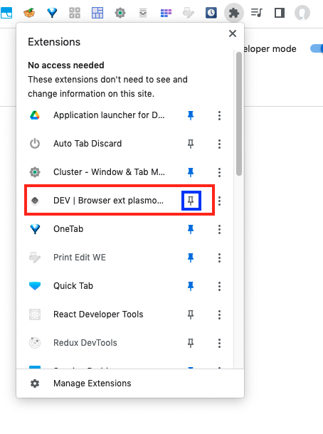

# browser-extension-plasmo-tutorial
Step by step tutorial(s) for Plasmo web browsers extension framework

Following the first video [Create a Google Chrome extension with ReactJS | Plasmo quickstart tutorial](https://www.youtube.com/watch?v=Fa2nFDw-dBw) (June 19th 2022 18mn)

```
$ node --version
v21.7.1
$ pnpm dlx plasmo init "browser-ext-plasmo-tutorial"
```


To run/compile/generate the extension:

```
$ cd browser-ext-plasmo-tutorial && pnpm dev
```


Now, go to the Chrome Extensions page:


Verify that the Developer mode is activated in the upper right corner and use the upper left button `Load unpacked` to select the newly generated extension code:


Once done, access the extension Icon in the upper right corner to pin the new extension:




The new extension icon is now visible within the list of pinned extensions in the upper right corner:


and once clicked the extension code is executed and appears:


